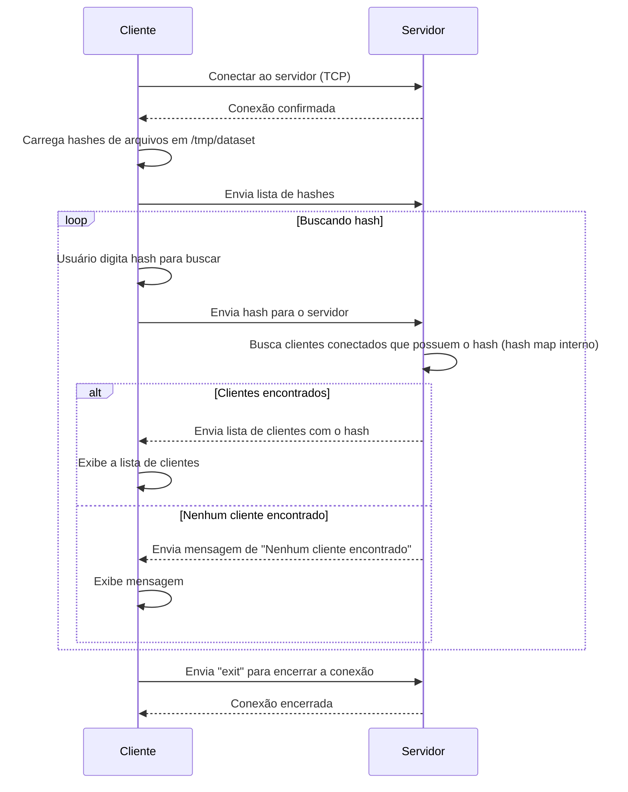

# Laboratório 5 - Programação Concorrente

### Grupo: Leandro Souto, Raniel Dourado e Sara Siqueira.

***
O nosso projeto optou por realizar o sistema de compartilhamento e pesquisa de arquivos através da abordagem Client-Server (Cliente-Servidor), na qual uma máquina centraliza o redirecionamento da busca por arquivos por uma conexão TCP e mantendo uma lista com os hashes dos clientes, enquanto outras máquinas buscam por clientes que possuem os arquivos desejados.


### 1. Preparação do ambiente das máquinas

Cada máquina deve executar o script `src/make-dataset/make_dataset.sh n`, sendo 'n' a quantidade de arquivos a serem gerados. Além disso, todas as máquinas devem ter este repositório instalado a fim de possuírem os respectivos códigos de servidor e cliente.

O diretório `dataset` deve ser movido para o diretório `/tmp/` de cada máquina.

### 2. Executando o servidor
Uma máquina deve ser selecionada para agir como servidor. Ela deve executar o comando ```go run src/server/main.go``` dentro do diretório ```lab_5```.

O servidor cria um socket TCP e executa na porta 13000. Através da goRoutine ```handleConnection()``` vários clientes são aceitos no sistema de forma concorrente.

O IP do cliente fica salvo e é usado como a sua identificação no hash-map ***client***. Durante a adição de novos clientes no sistema, um mutex protege a região crítica ***clients[clientAddr] = clientHashes***, o que impede que um cliente acabe tendo o hash de outro caso surjam problemas de concorrência.

Após receber do cliente o hash que deve ser encontrado, o servidor executa a função ***clientsWithFile := findClientsWithHash(requestedHash)***, que busca por outros clientes que possuam o mesmo arquivo. Cada cliente que corresponde ao que foi pedido é então adicionado à lista ***clientsWithFile.***


### 3. Executando o cliente
Outras máquinas presentes na mesma rede e que queiram saber quais clientes possuem os arquivos desejados devem executar o comando ```go run src/client/main.go [endereço do server][porta do servidor]```. 

A função ***loadHashesFromDataset()*** calcula o hash dos arquivos presentes no diretório ```/tmp/dataset``` e envia a lista de hashes para o servidor. Caso queira buscar outros clientes que possuam os mesmos hashes, o cliente passa o hash desejado ao servidor e ele se encarrega de buscar na rede outros endereços que possuam os mesmos arquivos.

### 4. Conclusão
Após executar o cliente e o servidor, várias máquinas presentes na mesma rede, simultaneamente, podem acessar o servidor e buscar por outros clientes que possuem o arquivo que está sendo pedido sem maiores problemas de concorrência.